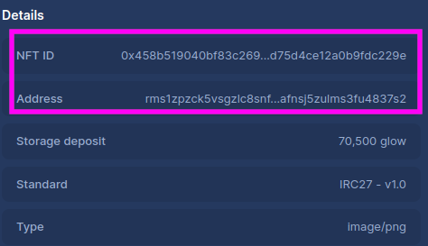

# Shimmer Zealy NFT minter/dropper

This repository contains a module to send NFTs to users who completed a quest and won an NFT airdrop. The module contains four functions:

1. get_nft_winners(): retrieves the list of the winners of the NFT airdrop by querying the Zealy API with a specific quest ID and status.
1. get_smr_address_submitters(status: str): returns a list of submitters for a given status of SMR address.
1. get_smr_address_from_quest_completers(): retrieves the SMR addresses of users who completed a quest and won an NFT airdrop.
1. send_to_address(addresses: list): sends NFTs to the addresses, if addresses are present.

This module imports several variables and functions from the tools module. Please ensure you have the necessary authentication tokens before running the module.

## Usage

- Copy and change all necessary info in .env
- Install the requirements with `pip install -r requirements.txt`
- Run with `python main.py`

## Requirements and TODO list for setting up the bot

- Generate a 24 words BIP39 mnemonic, ex novo, which means do NEVER use your existing 24 words. Generate new ones exclusively for this bot.
- Use the libraries or the Firefly wallet to mint the so called `collection NFT`, this NFT will be the master NFT for this whole collection.
- Set the `collection NFT id` and `collection NFT address` in the `.env` file

- Set the NFTs metadata for your NFTs in `tools.py` [around line 300](https://github.com/antonionardella/shimmer-zealy-nft-dropper/blob/42711deb731d0edf4215424c8c79c4a40aee0a2b/tools.py#L300)

### If you switch to mainnet

- Set the correct node in the `.env` file
- Set the correct SHIMMER_HRP in the `.env` file (`rms1` for testnet, `smr1` for mainnet)
- Change line 151 `networkId` in `tools.py` [here](https://github.com/antonionardella/shimmer-zealy-nft-dropper/blob/42711deb731d0edf4215424c8c79c4a40aee0a2b/tools.py#L151). Look at the comments above for the correct IDs

## License

This code is licensed under the Apache 2.0 License. Please see the LICENSE file for more information.
